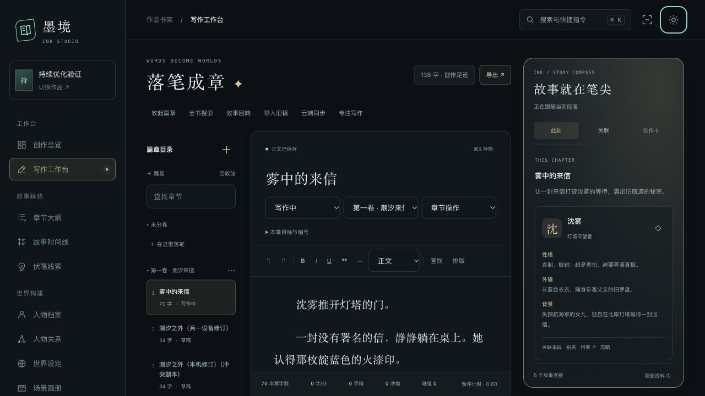
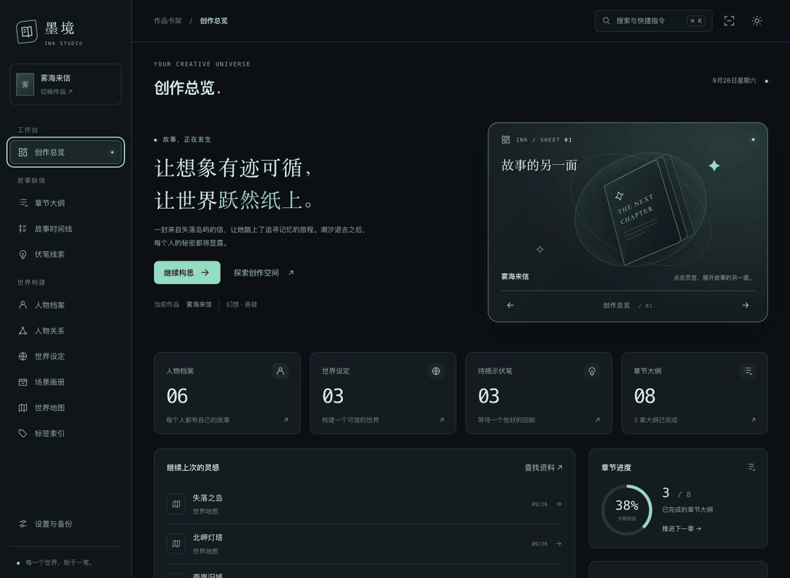
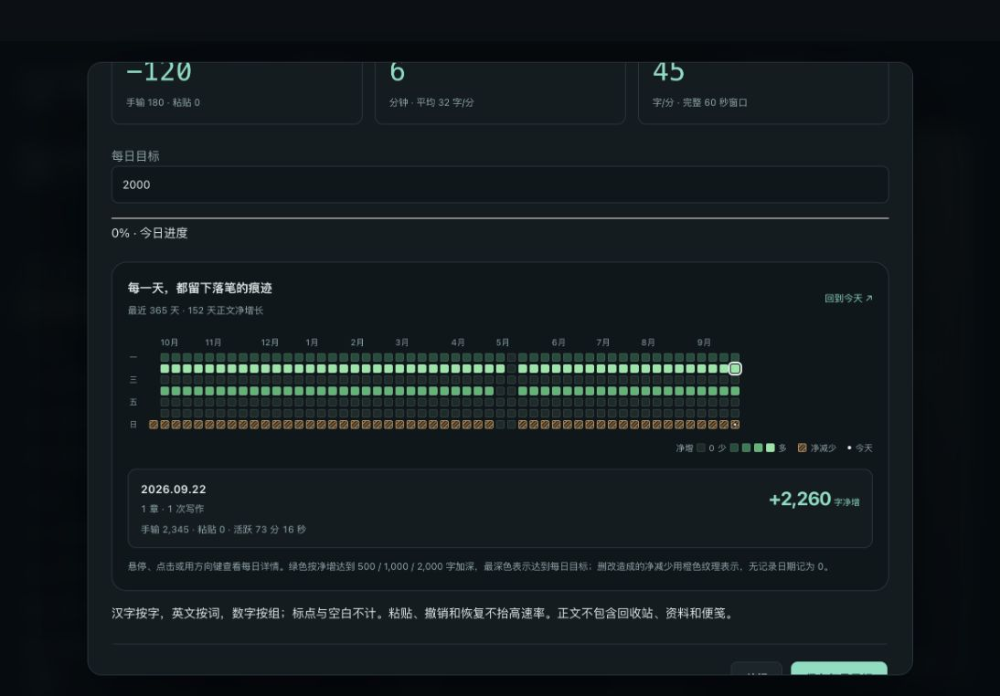

# 墨境 · INK STUDIO

> ⚠️ **本项目采用纯AI开发，所有代码及文字皆由AI操作，为试验性项目。**

**把故事资料与正文写作放在同一张桌面上。**

面向本地使用的小说创作工作室，支持多部作品、篇卷章节、人物与世界设定、正文关联、WebDAV 同步和 Word 导出。

[写作指南](docs/writing-guide.md) · [方案逐项核对](docs/writing-scope-audit.md) · [界面与快捷操作](docs/ink-studio.md) · [维护手册](docs/maintenance.md) · [反馈问题](https://github.com/llcgwh/novel_assistant/issues)



## 可以用它做什么

| 创作环节 | 功能 |
| --- | --- |
| 管理作品 | 装帧书架、封面、作品搜索与筛选、继续写作；正文与资料按作品隔离。 |
| 整理篇章 | 作品 → 篇卷 → 章节；排序、移动、复制、拆章合章、章节状态与回收站。 |
| 写下正文 | 富文本、中文输入、查找替换、字体排版、段落聚焦、打字机滚动与手机专注模式。 |
| 随写随查 | 光标所在段落识别人名和别名；绑定人物、时间线、伏笔、场景、大纲、世界观、地图和标签。 |
| 串联故事 | 资料页反向跳回章节段落，选中文字建立资料，大纲生成章节，创作便笺与故事回响。 |
| 看见进度 | 手输、粘贴与净增分别统计；实时与峰值速率、活跃时间、章节及全书字数、每日目标与码字日历。 |
| 保护稿件 | 自动保存、本机草稿、历史比较与恢复；多窗口冲突保留副本，WebDAV 同步整部作品。 |
| 导入交稿 | TXT / Markdown 拆章导入；按章节、篇卷或全书导出 DOCX、TXT、Markdown。 |

人物档案、场景画册、时间轴、伏笔、大纲、世界观、地图、关系图谱与关系组、标签和全局搜索也可独立使用。正文关联把这些资料接回写作现场；常用创作功能无需调用付费 AI。

## 一张会跟随创作的空间折页



同一张折页随模块切换翻转、移动和展开，显示当前模块的索引、进度或导览；进入写作页后成为「故事罗盘」。夜航 / 晨雾双主题、专注计时、快捷指令（⌘K / Ctrl+K）和响应式布局覆盖整套工作室，也提供减少动态效果适配。

从书架进入作品，书封翻转并落入预留的折页位置；返回时又合回书架。码字日历以全年周网格呈现，绿色深浅表示每日净增，悬停或点击可查看手输、粘贴、活跃时间等详情。



截图和动图使用独立测试库中的虚构作品。更多操作见 [工作室说明](docs/ink-studio.md)。

## 本地运行

需要 **Java 17+、Maven 3.x、PostgreSQL、Node.js 22.12+**。

### 1. 获取项目并准备数据库

```sh
git clone https://github.com/llcgwh/novel_assistant.git
cd novel_assistant
createdb -U postgres novel_writing
```

新数据库会按实体自动创建表，已有数据库会按当前配置更新结构。升级前先备份数据库、上传图片和密钥；手动管理表结构的安装请查看 [维护手册](docs/maintenance.md)。

### 2. 启动后端

在仓库根目录执行，用环境变量设置自己的数据库连接：

```sh
cd backend
export SPRING_DATASOURCE_URL='jdbc:postgresql://localhost:5432/novel_writing'
export SPRING_DATASOURCE_USERNAME='postgres'
export SPRING_DATASOURCE_PASSWORD='你的数据库密码'
mvn spring-boot:run
```

后端默认运行于 `http://localhost:8080`，上传文件默认保存在 `backend/uploads/`。也可在本地调整 `backend/src/main/resources/application.properties`；不要提交自己的连接凭据。

### 3. 启动 Vue 前端

另开终端，在仓库根目录执行：

```sh
cd frontend-vue
npm ci
npm run dev
```

打开 **http://localhost:3000**，创建作品后进入「写作工作台」。开发服务器将 `/api` 代理到后端；后端使用其他地址时，通过 `VITE_API_PROXY_TARGET` 配置。停止服务时，在各自终端按 Ctrl+C。

生产静态资源通过 `npm run build` 输出到 `frontend-vue/dist/`。部署时仍需运行 Java 后端，并为前端配置 API 访问或反向代理。

## 保存、同步与迁移

- **浏览器草稿**：已打开的章节断网后仍可编辑，草稿保存在本浏览器。尚未提交的草稿不会进入服务端备份，迁移或清理站点数据前先确认正文已保存。
- **章节历史**：自动历史、手动存档、版本比较与恢复；并发修改会提示冲突，可保留两份稿件。回收站内章节不计入正文总字数，也不参与导出。
- **完整备份**：`.backup.json` 包含正文、资料、段落关联、人物别名、图片、统计和最近 2,000 条历史快照。无正文的旧版备份不能直接覆盖已有稿件，可恢复到新作品。
- **WebDAV**：配置并启用后，后端运行期间约每五分钟检查并上传有改动的作品。采用远端版本前会保存本机完整副本，冲突由作者比较处理；远端历史目前不自动清理。
- **交稿文件**：DOCX / TXT / Markdown 用于阅读、交稿和继续加工，不代替完整备份。Markdown 导入以文本和章节标题为主；Word 目录开启后需在 Word 中更新目录域。

含图片备份限每张 8 MiB、图片合计 32 MiB、文件合计 48 MiB，损坏或超限会明确报错。外部图片内容、浏览器外观偏好和 WebDAV 密码不包含在作品包内；外观偏好可在设置页单独导出。

WebDAV 密码使用 AES-256-GCM 加密；默认密钥为后端工作目录下的 `.secrets/webdav.key`，需与数据库分别妥善备份。详见 [密码与密钥说明](docs/credential-storage.md) 和 [写作指南](docs/writing-guide.md)。

## 开发与验证

前端采用 **Vue 3 · TypeScript · Vite · Pinia · Tiptap**，后端采用 **Spring Boot 3 · Java 17 · Spring Data JPA · PostgreSQL**。

```text
novel_assistant/
├── frontend-vue/  # 当前前端、界面与浏览器侧测试
├── backend/       # API、正文服务、导出、同步与后端测试
├── database/      # 基础结构与历史迁移脚本
├── scripts/       # 独立 PostgreSQL / WebDAV 集成回归
└── docs/          # 使用指南、维护记录与实测截图
```

旧原生前端已移除，前端开发请使用 `frontend-vue/`。

```sh
# 在 backend/ 中
mvn test

# 在 frontend-vue/ 中
npm ci
npm test
npm run build
```

真实服务回归会创建独立测试数据库，覆盖事务保存、备份恢复、图片迁移、WebDAV 和写作冲突。环境准备与清理步骤见 [维护手册](docs/maintenance.md)，功能演进见 [写作实施记录](docs/writing-implementation.md) 和 [分批修复记录](docs/maintenance-batches.md)。

## 关于这个项目

**llcg** 负责需求、创作方向与迭代反馈，代码与文档由 AI 完成。不同阶段的模型协作构成了现在的墨境：

| 参与模型 | 主要参与 |
| --- | --- |
| Claude | 搭建项目基础框架，建立初始页面与故事资料管理模块。 |
| DeepSeek | 在初始框架上进一步完善功能、交互与项目实现。 |
| GPT | 持续修复保存与备份可靠性，建设 Ink Studio 视觉及写作工作台，补充资料联动、同步导出与回归验证。 |

欢迎通过 [GitHub Issues](https://github.com/llcgwh/novel_assistant/issues) 反馈问题与想法。

[项目仓库](https://github.com/llcgwh/novel_assistant) · [llcg 的 GitHub](https://github.com/llcgwh) · [llcgwh0210@gmail.com](mailto:llcgwh0210@gmail.com)

本项目仅供学习和个人使用。
