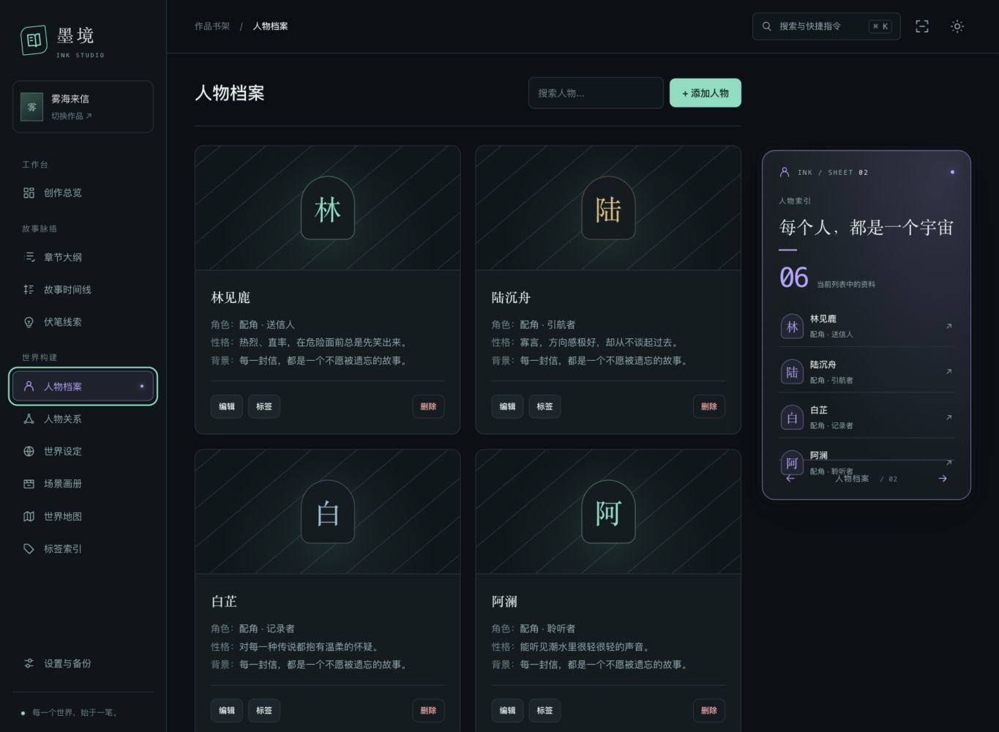
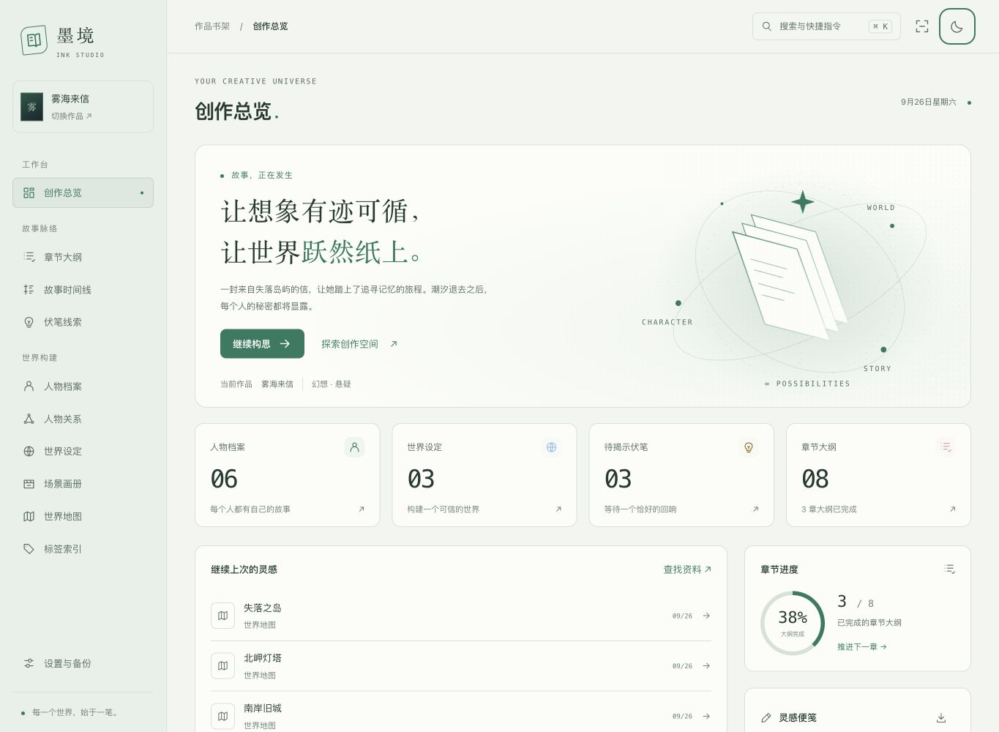

# 墨境工作室

## 从书架开始

没有上传封面的作品会显示几何装帧封面。搜索框同时匹配标题、作者和简介，可叠加创作状态筛选；排序不会更改服务器数据。点击作品进入创作总览。创建作品后，可在书架的编辑按钮中上传封面。

## 日常创作

### 空间折页

点击侧栏页签或手机模块选择器时，同一张折页会离开原位置，翻转半圈，调整尺寸并落到新位置；内容在翻到侧面时切换。翻转方向跟随模块顺序，侧栏选中标记连续移动。

GIF 是浏览器截图抽帧，应用中为连续动画。12 个模块使用各自的色彩和内容：总览是立体故事书，人物与伏笔在右侧展开索引，时间线与世界观在左侧展示导览，大纲、场景、关系和地图展开为顶部横幅；标签、搜索、设置也有对应折页。

索引和统计读取当前列表，随筛选与编辑更新；章节条显示当前列表的构思、写作、完成数量。点击索引直接编辑条目，关系折页中的人物链接进入人物编辑。底部箭头也能切换模块。手机按空间压缩装饰与索引，保留页面主体的全部操作。

“设置与备份”折页提供空间转场开关，保存于当前浏览器；系统启用减少动态效果时自动直接切换。快速连点只保留最后一次目的地，转场中滚动或缩放会立即停靠，专注模式下重新对齐。

### 创作工具

- 总览统计当前小说的人物、世界设定、待揭示伏笔和章节大纲。进度指已完成的大纲比例，不代表正文字数或整本小说完成度。请求失败时显示缺失提示与重试入口。
- “继续上次的灵感”按更新时间排列最近五条资料，点击直接打开编辑。
- 顶部搜索按钮或 ⌘K / Ctrl+K 打开快捷指令；输入模块名后 Enter 跳转，输入资料关键词后搜索当前小说。上下方向键选择，Esc 或“关闭”退出。
- 专注模式收起侧栏，仍可用顶部模块选择器和书架按钮导航。
- 15/25/45 分钟计时使用实际截止时间，页面切换、刷新或后台运行不会因为丢帧而延长计时；可暂停、重置。完成提示在重新打开总览时显示，没有系统通知或声音。

## 灵感与偏好保存在哪里

灵感便笺仅保存在当前浏览器，按小说 ID 隔离，最多 20,000 个字符。输入即时自动保存；存储空间不足时明确提示，并保留当前文本供导出。Markdown 导出包含便笺原文。

便笺、计时、主题选择和空间转场开关使用浏览器 localStorage，不随服务器小说备份或 WebDAV 同步，也不包含在原有背景偏好文件中。重要便笺请单独导出；清除浏览器站点数据会移除这些本地内容。

## 图谱、地图与小屏

人物关系图根据主题重绘，节点支持点击打开人物。地图始终使用 800 × 600 的逻辑坐标；显示尺寸与屏幕像素密度只影响渲染，不改变已保存地点。移动端标签保持可读，地图缩放显示后的点击也会转换回逻辑坐标。

手机使用顶部模块选择器，返回书架不需要打开侧栏。页面保留键盘焦点提示，系统开启减少动态效果后，装饰动画和过渡会关闭。

## 开发验证

`cd frontend-vue && npm test && npm run build`

48 项前端回归覆盖组合筛选、最近条目排序、便笺隔离和导出、存储失败、计时恢复与清理、书架封面上传归属、地图尺寸换算，以及折页中途换面、连续导航取消、离开后的清理。截图与浏览器验证采用独立 PostgreSQL 测试库中的虚构作品；演示数据不写入用户小说库，也不随产品代码安装。
