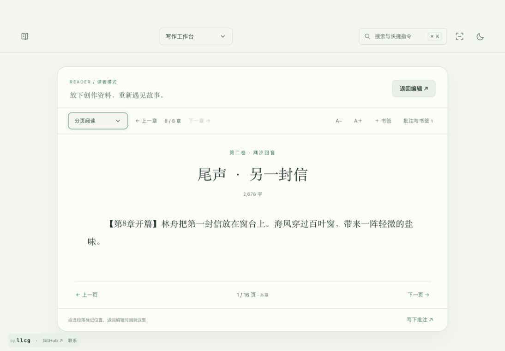
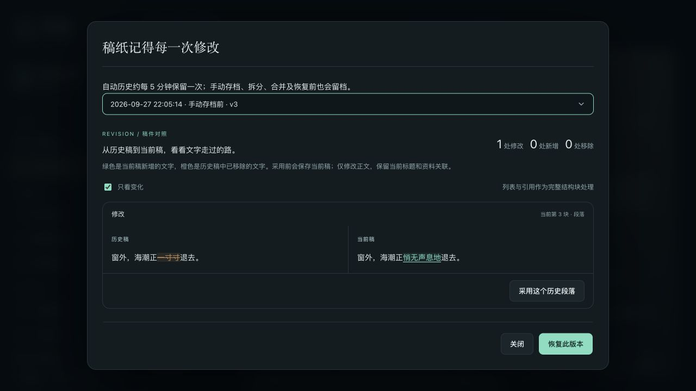

# 写作工作台使用指南

选择作品后进入「写作工作台」，也可从书架的「落笔」或总览的继续写作入口返回章节。书架显示全书字数、最近编辑章节、今日净增与目标；最近章节按服务端保存时间确定。每部作品独立保存正文、资料关联、别名和统计。

从书架进入作品会展开对应书封，回到书架会反向收拢；作品内继续使用空间折页转场。在设置中关闭空间动态，或系统启用减少动态效果时，会跳过这些动画。界面保留小型 llcg 署名、项目 GitHub 和邮件入口，不占用正文工具栏。

## 篇卷与章节

左侧目录创建篇卷和章节；「章节操作」提供复制、移动、拆章、合章、历史和回收站。可拖动排序，也可使用向前/向后移动。删除篇卷时保留章节，正文删除先进入回收站。

拆章从光标所在段落开始，段落关联一起移动。合章把下一章追加到当前章，保留段落关联，并将来源章放入回收站。章节状态有草稿、写作中、待修订和定稿；每章可设置字数目标，序言等可关闭编号。编号随目录顺序计算。

## 写作与保存

- 顶部提供粗体、斜体、下划线、引用、小标题、项目列表、分隔线、撤销和查找替换。
- 「排版」调整字体、字号、行距、首行缩进和阅读宽度（窄幅 / 适中 / 宽幅），也可开启段落聚焦、打字机滚动。字体与阅读宽度保存在本浏览器，手机端不会超出可用宽度。专注模式收起目录和资料，手机也能专注写正文。
- 停止编辑约 1.2 秒自动保存。页面明确区分服务端已保存、本机草稿和保存失败；⌘S / Ctrl+S 或「存档」创建手动快照。
- 已打开章节断网后可继续写，草稿存入本浏览器 IndexedDB，恢复联网后继续保存。首次打开、读取其他章节与完整应用离线启动仍需要服务端。
- 下次打开若发现未提交的草稿，会先提供恢复选项。请勿在草稿未上传前清理站点数据或切换浏览器配置文件。
- 多窗口修改同章会比较版本，不静默覆盖。可以保留独立冲突副本、明确采用本机稿或采用服务端稿。

历史面板显示最近 100 条快照，绿色标出当前新增、橙色标出历史中已移除的文字，可勾选「只看变化」。每次展示 20 个段落或结构块。自动历史在有保存时约每五分钟保留一次；手动存档保存本次提交，同时保留提交前版本。章节正文 JSON 上限为 2 MiB。

可以逐段采用历史内容、恢复已删除的历史段落，或移除当前新增段落；每次操作前先保存当前稿，并保留当前章名、创作卡与资料关联。列表和引用以完整结构块处理，排版变化单独提示；长段落的大范围改写会合并高亮区间，避免计算卡顿。逐块采用保留当前位置，恢复历史顺序请使用「恢复此版本」。整章恢复也会恢复历史章名、摘要、笔记及关联，执行前同样留档。拆分、合并和整本恢复均保留历史。

## 下一笔、阅读与修订

写作工具栏下的「下一笔」可记下下一幕、当前卡点或一句未完的话，至少填一项即可。它同时保留章节、段落和原文摘录，便于下次从总览或「接着写」回到当时的位置。更新内容默认保留原定位；在别的段落续写时，可明确改为当前位置。便签不是离开前的必填步骤。

「读者模式」先保存当前正文，再切换为只读稿纸，收起编辑工具与资料罗盘。可调整字号、逐章翻阅，点击段落加书签，也可选择原文后「写下批注」。提交批注会建立带原文定位的修订任务；返回编辑时定位到选中的段落。阅读和批注不增加正文码字统计。阅读方式可选择逐章、全书连续或分页：连续模式滚动接续后续章节，正文按需载入；分页模式按窗口实际排版，支持左右方向键翻页，输入批注时不接管按键。字号和阅读方式在此浏览器保留。调整字号或宽度后定位当前段落；超长段落跨多页时会回到该段起始页，暂不保留段内字符位置。知情范围仍待 C01/C02 实现。

阅读位置随实际章节更新，刷新或返回编辑仍回到该章。未提交批注按作品及章节暂存，切到其他章后可返回继续；存储失败会提示并保护离开。按需载入的正文仅为本次阅读缓存，不等同于完整离线下载。

「修订清单」按对白、视角、措辞、设定、伏笔等分类管理问题，可以设置优先级、编辑说明、标记完成或重新打开，并按类别、状态和优先级筛选。点击来源返回正文；章节进入回收站或被删除时会明确提示。底部「比较当前章节历史」直接进入正文差异面板。

「新建轮次」可安排对白复核、视角检查等阶段，分别填写名称与目标，将任务归入对应轮次，并查看本轮完成数与进度。旧任务和阅读批注默认在「未分组」，编辑时可调整轮次。归档保留任务，重新开始也不会重置完成记录；归档中的轮次仍可回看和修改任务。每部作品最多 100 轮，轮次名称最多 120 字符、目标最多 1,000 字符。这里统计任务完成情况；码字日历的「修订保存」统计成功保存的正文文本变化，两者独立。

下一笔、修订任务和阅读书签按作品保存，独立检测版本冲突，并参与完整备份与 WebDAV。下一笔和阅读批注的未提交输入另存于本浏览器；刷新可找回，但尚未提交的内容不进入云端包。保存失败会保留输入；发现其他窗口或设备更新时，先刷新比较，再明确选择保留哪份，不能静默覆盖。修订弹窗内尚未保存的编辑不承诺刷新恢复，离开前请先保存。

拆分或合并章节时，指向实际段落的便签、任务和书签跟随段落迁移。仅绑定整章的记录保持原章节；普通删改造成原段落失效时，仍保留章节与摘录供核对。每部作品最多 1,000 条修订任务和 500 个书签；全部记录合计上限 2 MiB。

## 灵感收件箱

总览和写作页的「灵感收件箱」保存未进入正文的素材，可按情节、人物、场景、设定、对白或其他分类，一条灵感可关联多章。在写作页拖到创作便笺，或点「放入当前创作卡」，会把内容复制到当前章的创作笔记，来源灵感继续保留；重复放入相同内容不会追加同一份完整副本，不增加正文字数。

发现旧浏览器便笺时，先「预览并迁移旧便笺」，确认后保存到作品。原文的空行和空白保留，长文按单条容量拆分；本机原件不删除，可单独导出。重复迁移或响应丢失后重试，不重复创建同一批素材。

输入自动暂存于本浏览器，点击「保存灵感」后才参与作品备份和同步。未提交草稿可刷新找回；保存结果不明时重试原请求，或读取最新版本后比较。发生版本冲突会保留草稿，不自动覆盖另一份。浏览器存储失败时请先保存或导出再离开；「导出全部灵感 Markdown」也会附上本机草稿、待确认请求和旧便笺原件，并分段注明来源。

每部作品最多 1,000 条灵感，单条正文最多 20,000 字符、关联最多 200 章；灵感与下一笔、修订任务、轮次和书签共用 2 MiB 创作文档上限。超限会保留输入并提示失败，不截断内容。章节拆分会保留原章关联并增加新章，合章合并关联；无效章节会明确标出。

## 让资料跟着正文走

右侧空间折页在写作页变为「故事罗盘」，有三个页签：

| 页签 | 用途 |
| --- | --- |
| 此刻 | 根据光标段落中的姓名/别名展示人物头像、身份、性格、外貌、背景与关系；显示当前事件、相关人物场景与前后事件，以及场景图、地点和设定。 |
| 关联 | 选择时间线、伏笔、角色、场景、大纲、世界观、地图或标签，关联整章或当前段落，并选择此刻事件、视角人物、埋设、暗示、推进、揭示等用途。 |
| 创作卡 | 汇总本章字数目标、视角人物、场景地点、大纲与此刻事件，维护创作目标和任务便笺。选中文字可快速建立人物、伏笔、场景、设定或修订便签，并保留来源。 |

人物的「别名」支持昵称和称谓，随作品保存；名字识别在中文输入完成后更新，重要关联由作者确认。同名或重叠别名保留候选，不自动合并。可固定人物卡、忽略误识别；固定和忽略属于当前工作区状态，重新载入工作区会重置。

时间线的前后事件按故事顺序排列，与章节叙述顺序分开；一章可以关联多个事件，并分别定位到段落。场景和地图信息来自已建立的资料及关联。

伏笔可先勾选「先列入本章计划」，选择计划埋设、暗示、推进或揭示。在「本章伏笔回收账」中勾选「已在正文处理」后，才记为对应的已处理关联；取消勾选可回到计划状态。面板分别显示计划、已记录与仍待回收线索，判断依据是显式关联和资料状态，不分析正文是否真的完成了剧情。

任务便笺中的 `[ ]` / `[x]` 可点击切换；选文创建修订便签会附上来源章节、段落标识及原文。

资料编辑弹窗增加「涉及章节」，点击可回到关联段落。人物档案的「登场足迹」标出首次与最近登场：按篇卷、章节、段落的叙述顺序，仅统计明确关联；失效段落不计入首末。

被删资料或失效段落会标出，并保留章节入口。大纲可生成关联章节，一条大纲也可以关联多章；「故事回响」按人物、事件或伏笔筛选并串联章节，列出未落成正文的大纲和待回收伏笔。它是可跳转的章节列表，不是自动分析剧情的关系图。写作页全书搜索和全局搜索均可跳入正文定位。

## 统计口径

稿纸底部显示本章字数、含标点字符数、当前速率、本次手输、粘贴、净增、峰值和活跃计时。「创作足迹」展示当前章、当前卷（未分卷时汇总未分卷章节）、全书字数，以及今日数据、每日目标和最近 365 天的码字日历。

- 汉字按字，英文按词，数字按连续组统计；标点和空白不计。副指标「含标点字符数」按 Unicode 字符计数，包含标点，不含空白和换行。回收站、资料和便笺不计正文总字数。
- 速率统计最近 60 秒的手工输入；峰值在形成完整 60 秒窗口后记录。粘贴单独统计，撤销、替换和恢复不抬高手输速率。
- 净增反映正文长度变化，删除会抵扣；它不一定等于手输或粘贴之和。
- 「修订保存」按正文文本发生变化且成功保存的次数计。同字数替换、纯删除也计一次；只改标题、笔记、状态或文字样式不计，原文存档、失败请求和重复重试不计。它不是修改字数，也不是修订任务完成数。创建、导入、拆合章和整本恢复不凭空产生这项活动。
- 「定稿章数」统计当天真实从其他状态进入定稿的章节，按章节去重；每日详情另列进入定稿的转换次数。同章离开定稿后再次进入，会多一次转换，但当日章数不重复增加。创建即定稿、回收站恢复和整本恢复不计入转换。
- 无输入超过 60 秒不继续累计活跃时间，也可手动暂停。每日统计按浏览器本地日期分日。今日平均速率 = 今日手输字数 ÷ 活跃分钟；底栏峰值属于本次会话，足迹面板峰值取已保存会话的最高值。
- 专注时长来自专注计时器，与正文输入活跃时间分别统计。暂停期间不计时；取消、重置或切换时长保留已投入时间，只有自然到时才增加完成段数。
- 已提交统计随作品同步；尚未上传的写作会话和专注记录在本浏览器暂存，重复提交不会重复累计。

每日目标在当前本地日期首次访问或提交活动时留快照，调整今日目标只更新今日快照。旧日期没有快照时显示「未记录目标」，不能推断当天是否达标；目标设为 0 则显示「未设目标」。迟到的旧日活动不会补上今日目标。旧客户端未传本地日期时，服务端以自身日期兼容处理。

日历按周排成类似 GitHub 贡献图的格子。正净增按当天保存的目标分四档绿色，最深色表示达到该日目标；未设目标或未记录目标时按 2,000 字展示颜色，不能据此认定达标。0 为底色，负净增用橙色纹理表示。改变今日目标不重算过去的目标或达成记录。

悬停、键盘聚焦或点击日期，可看目标、净增、修订保存、定稿章数与转换次数、专注段数与时长，以及手输、粘贴、活跃时间和写作会话；方向键移动日期，Home / End 跳到本周首尾，「回到今天」快速定位。手机可横向浏览日历，点击后保留详情。

专注计时刷新后继续按原截止时间结算，跨午夜的实际运行时间分入对应本地日期；完成归实际截止日，而非再次打开页面的日期。暂停后继续使用同一时段，完成或取消后才提交终态。旧版本计时器缺少时段身份和暂停历史，升级时保留倒计时，但不追溯补数；重新开始的新时段才计入统计。运行中时段、未上传记录只在本机，迁移前先结束并确认上传。

上传失败会保留原专注记录，可点击「重试」，恢复网络后也会重试；错误提示旁可导出本机记录。同一时段在多窗口形成不同结束结果时，两份记录都保留，服务端已确认的结果不被覆盖，其他时段仍能上传。终态冲突不能靠重复点击重试解决，可先导出保留原件。统计文档最多 8 MiB，每部作品最多 20,000 条专注终态和 36,600 个统计日期；达到上限会明确拒绝新增记录，不自动清理或截断。容量不足时单纯重试不会解决上限，请保留本机记录；当前未提供统计清理功能。验收记录见 [产品 case 清单](product-cases.md)。

## 导入与交稿

「导入旧稿」接受 UTF-8 TXT / Markdown，单文件最多 4 MiB，识别章节标题后允许预览、改名及选择篇卷。导入增加章节，不覆盖旧章。Markdown 按文本导入并识别标题，不保证还原所有 Markdown 富文本格式。

「导出」可选择整本、当前篇卷、当前章节或指定章节：

| 格式 | 适用场景 |
| --- | --- |
| Word `.docx` | 保留常用富文本、篇卷标题和章节顺序，可选择标题页、章节分页与目录域。 |
| `.txt` | UTF-8 纯文本交稿。 |
| `.md` | 保留标题层级及常用文字样式，便于继续整理。 |

默认只导出正文。勾选「附加创作笔记与关联资料」后，三种格式都在正文末尾追加按章节分组的创作附录，包含笔记、关联人物卡的身份/性格/外貌/背景、伏笔说明及其他关联资料内容。灵感也会列入附录：整本导出包含全部已保存灵感，选定范围导出只包含关联到所选章节的灵感。附录只读取本作品资料，重复关联合并用途，失效资料会明确标记。它不替代含完整关联结构、计划状态和历史的 JSON 备份。

Word 目录默认关闭。开启后需在 Word 中更新目录域生成目录和页码；各阅读器的自动更新行为不同。单独导出部分章节仍沿用全书编号，回收站不导出。

## WebDAV 与整本备份

先在「设置与备份」配置并测试 WebDAV，然后打开写作页的「云端同步」。同步包包含正文、资料、段落关联、别名、图片、统计、每日目标快照、已上传的专注回执、历史，以及已保存的下一笔、修订任务、轮次、阅读书签和灵感。既有设置页的备份功能仍可使用。

开启自动同步后，后端运行期间约每五分钟检查并上传有更改的作品；关闭浏览器不会让仍运行的后端停止同步，关闭后端则不会执行。它自动上传，不自动用远端覆盖本机。连接失败后会在后续调度重试，也可手动重试；版本冲突需要先比较处理。

另一设备可创建作品、配置同一 WebDAV，在「跨设备连接」粘贴源作品的云端标识，读取版本并比较。每个远端版本独立保存；发现其他设备更新或并行分支时，上传会停下来提示处理。比较面板支持逐章查看两端全文。同步面板显示待上传/同步中/上次结果等状态；设置页的「永久操作记录」另行保存本服务数据库中的备份、上传、恢复、清理及失败记录，支持读取更早记录和展开详情。它不会冒充另一台独立服务器的操作日志，也不随作品恢复而回退。

采用远端版本前，本机会复制出一部名为「同步前副本」的完整作品，再恢复正文和资料。旧本机内容可从书架副本取回。确认采用后，下一次上传收拢已处理分支；若云端期间再次变化，会再次要求比较。冲突采用人工比较和副本保留，不自动合并两份正文。

完整离线迁移用 `.backup.json`，正文导出不包含全部资料和关联。schema 3 包含最近 2,000 条历史快照；无正文的旧备份应导入新作品，避免覆盖已有文稿。每张图片最多 8 MiB，图片合计 32 MiB，整个备份最多 48 MiB，超限会明确报错。

旧备份若缺少下一笔、修订任务、阅读书签、轮次、灵感或创作统计，而当前作品已有对应记录，恢复会被拒绝，需改为导入新作品。云端采用同样规则；旧客户端遗漏已有轮次或灵感的保存请求也会被拒绝。创作统计独立于写作偏好，旧客户端更新偏好不会清空统计；恢复保留专注回执，旧上传请求重试不会再累计一次。创作记录不计全书字数，默认正文导出也不混入这些内容；灵感可按上文选择附录导出。

浏览器未提交草稿不在服务端备份中，迁移前先确认「正文已保存」。外部图片的实际内容、WebDAV 密码和浏览器外观偏好不随正文包迁移；外部图片地址仍依赖原服务可用。

设置页的空间管理显示当前云端作品快照、分支标记及共享旧版备份的已知大小。服务端未提供的配额或文件大小显示未知，不推算剩余空间。修改保留份数和天数只影响下一次清理预览，不自动删除文件。

清理必须先生成预览，核对拟删除文件、预计释放大小及保留原因，再勾选确认。保留天数和最新份数按远端报告的修改时间计算，日期未知的文件保留；不使用各设备无时区的文件名日期判断。预览十分钟有效；期间作品、连接配置、策略或远端目录变化时需要重新预览。取消不会提交删除。最新恢复基线、并行分支、首份快照、本机同步基线和未知文件保留；无法可靠判断作品归属的共享旧版备份不提供直接删除。清理会保留版本连接信息，避免旧分支因删历史而重新出现。

执行前检查完整恢复基线，并向 WebDAV 申请目录排他锁，使用条件请求核对文件身份。远端不支持必要的锁或条件保护时拒绝清理，不降低保护强行删除。失败或结果未确认时，查看本次操作详情并重新核对远端；重复读取原请求结果不会重复执行已结束的删除。保留策略不代替独立离线备份。

## 全局搜索入口

点击右上角「搜索与快捷指令」（或 ⌘/Ctrl K），再点「全局搜索」。无需填写关键词也能进入搜索页；已输入内容会带入当前作品的搜索。侧边栏保持原有布局。
