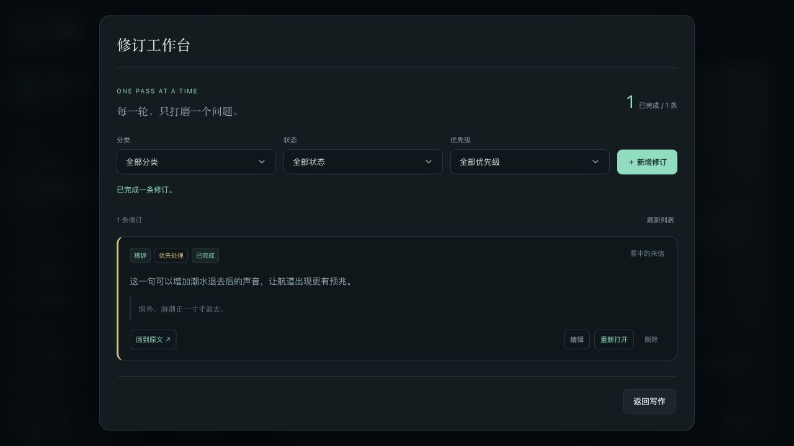
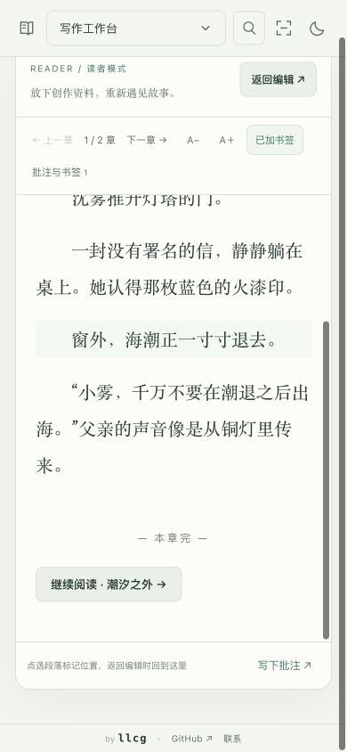
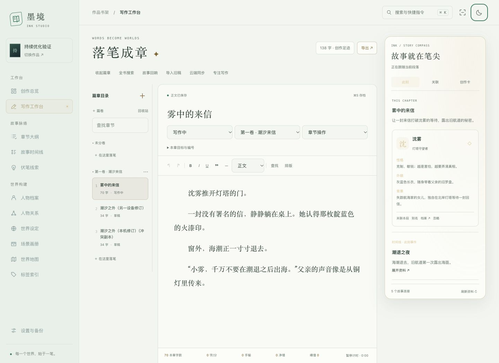
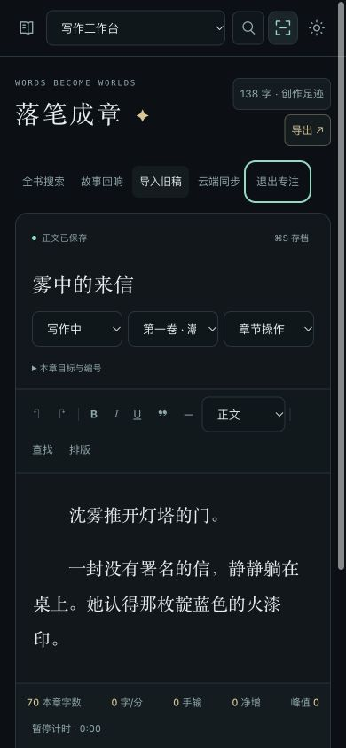

# 写作工作台使用指南

选择作品后进入「写作工作台」，也可从书架的「落笔」或总览的继续写作入口返回章节。书架显示全书字数、最近编辑章节、今日净增与目标；最近章节按服务端保存时间确定。每部作品独立保存正文、资料关联、别名和统计。

从书架进入作品会展开对应书封，回到书架会反向收拢；作品内继续使用空间折页转场。在设置中关闭空间动态，或系统启用减少动态效果时，会跳过这些动画。界面保留小型 llcg 署名、项目 GitHub 和邮件入口，不占用正文工具栏。

## 篇卷与章节

左侧目录创建篇卷和章节；「章节操作」提供复制、移动、拆章、合章、历史和回收站。可拖动排序，也可使用向前/向后移动。删除篇卷时保留章节，正文删除先进入回收站。

拆章从光标所在段落开始，段落关联一起移动。合章把下一章追加到当前章，保留段落关联，并将来源章放入回收站。章节状态有草稿、写作中、待修订和定稿；每章可设置字数目标，序言等可关闭编号。编号随目录顺序计算。

## 写作与保存

- 顶部提供粗体、斜体、下划线、引用、小标题、项目列表、分隔线、撤销和查找替换。
- 「排版」调整字体、字号、行距、首行缩进和阅读宽度（窄幅 / 适中 / 宽幅），也可开启段落聚焦、打字机滚动。字体与阅读宽度保存在本浏览器，手机端不会超出可用宽度。专注模式收起目录和资料，手机也能专注写正文。
- 停止编辑约 1.2 秒自动保存。页面明确区分服务端已保存、本机草稿和保存失败；⌘S / Ctrl+S 或「存档」创建手动快照。
- 已打开章节断网后可继续写，草稿存入本浏览器 IndexedDB，恢复联网后继续保存。首次打开、读取其他章节与完整应用离线启动仍需要服务端。
- 下次打开若发现未提交的草稿，会先提供恢复选项。请勿在草稿未上传前清理站点数据或切换浏览器配置文件。
- 多窗口修改同章会比较版本，不静默覆盖。可以保留独立冲突副本、明确采用本机稿或采用服务端稿。

历史面板显示最近 100 条快照并支持正文比较。自动历史在有保存时约每五分钟保留一次；手动存档保存本次提交，同时保留提交前版本。恢复历史前先存档当前修改，拆分、合并和整本恢复也保留历史。章节正文 JSON 上限为 2 MiB。

## 下一笔、阅读与修订

写作工具栏下的「下一笔」可记下下一幕、当前卡点或一句未完的话，至少填一项即可。它同时保留章节、段落和原文摘录，便于下次从总览或「接着写」回到当时的位置。更新内容默认保留原定位；在别的段落续写时，可明确改为当前位置。便签不是离开前的必填步骤。

「读者模式」先保存当前正文，再切换为只读稿纸，收起编辑工具与资料罗盘。可调整字号、逐章翻阅，点击段落加书签，也可选择原文后「写下批注」。提交批注会建立带原文定位的修订任务；返回编辑时定位到选中的段落。阅读和批注不增加正文码字统计。当前为逐章滚动阅读，全书连续阅读、分页和按读者知情范围展示仍在后续清单中。

「修订清单」按对白、视角、措辞、设定、伏笔等分类管理问题，可以设置优先级、编辑说明、标记完成或重新打开，并按类别、状态和优先级筛选。点击来源返回正文；章节进入回收站或被删除时会明确提示。它目前是结构化任务列表，修订轮次、历史增删高亮和逐段采用尚未加入。

下一笔、修订任务和阅读书签按作品保存，独立检测版本冲突，并参与完整备份与 WebDAV。下一笔和阅读批注的未提交输入另存于本浏览器；刷新可找回，但尚未提交的内容不进入云端包。保存失败会保留输入；发现其他窗口或设备更新时，先刷新比较，再明确选择保留哪份，不能静默覆盖。修订弹窗内尚未保存的编辑不承诺刷新恢复，离开前请先保存。

拆分或合并章节时，指向实际段落的便签、任务和书签跟随段落迁移。仅绑定整章的记录保持原章节；普通删改造成原段落失效时，仍保留章节与摘录供核对。每部作品最多 1,000 条修订任务和 500 个书签；全部记录合计上限 2 MiB。

## 让资料跟着正文走

右侧空间折页在写作页变为「故事罗盘」，有三个页签：

| 页签 | 用途 |
| --- | --- |
| 此刻 | 根据光标段落中的姓名/别名展示人物头像、身份、性格、外貌、背景与关系；显示当前事件、相关人物场景与前后事件，以及场景图、地点和设定。 |
| 关联 | 选择时间线、伏笔、角色、场景、大纲、世界观、地图或标签，关联整章或当前段落，并选择此刻事件、视角人物、埋设、暗示、推进、揭示等用途。 |
| 创作卡 | 汇总本章字数目标、视角人物、场景地点、大纲与此刻事件，维护创作目标和任务便笺。选中文字可快速建立人物、伏笔、场景、设定或修订便签，并保留来源。 |

人物的「别名」支持昵称和称谓，随作品保存；名字识别在中文输入完成后更新，重要关联由作者确认。同名或重叠别名保留候选，不自动合并。可固定人物卡、忽略误识别；固定和忽略属于当前工作区状态，重新载入工作区会重置。

时间线的前后事件按故事顺序排列，与章节叙述顺序分开；一章可以关联多个事件，并分别定位到段落。场景和地图信息来自已建立的资料及关联。

伏笔可先勾选「先列入本章计划」，选择计划埋设、暗示、推进或揭示。在「本章伏笔回收账」中勾选「已在正文处理」后，才记为对应的已处理关联；取消勾选可回到计划状态。面板分别显示计划、已记录与仍待回收线索，判断依据是显式关联和资料状态，不分析正文是否真的完成了剧情。

任务便笺中的 `[ ]` / `[x]` 可点击切换；选文创建修订便签会附上来源章节、段落标识及原文。

资料编辑弹窗增加「涉及章节」，点击可回到关联段落。人物档案的「登场足迹」标出首次与最近登场：按篇卷、章节、段落的叙述顺序，仅统计明确关联；失效段落不计入首末。

被删资料或失效段落会标出，并保留章节入口。大纲可生成关联章节，一条大纲也可以关联多章；「故事回响」按人物、事件或伏笔筛选并串联章节，列出未落成正文的大纲和待回收伏笔。它是可跳转的章节列表，不是自动分析剧情的关系图。写作页全书搜索和全局搜索均可跳入正文定位。

## 统计口径

稿纸底部显示本章字数、含标点字符数、当前速率、本次手输、粘贴、净增、峰值和活跃计时。「创作足迹」展示当前章、当前卷（未分卷时汇总未分卷章节）、全书字数，以及今日数据、每日目标和最近 365 天的码字日历。

- 汉字按字，英文按词，数字按连续组统计；标点和空白不计。副指标「含标点字符数」按 Unicode 字符计数，包含标点，不含空白和换行。回收站、资料和便笺不计正文总字数。
- 速率统计最近 60 秒的手工输入；峰值在形成完整 60 秒窗口后记录。粘贴单独统计，撤销、替换和恢复不抬高手输速率。
- 净增反映正文长度变化，删除会抵扣；它不一定等于手输或粘贴之和。
- 无输入超过 60 秒不继续累计活跃时间，也可手动暂停。每日统计按浏览器本地日期分日。今日平均速率 = 今日手输字数 ÷ 活跃分钟；底栏峰值属于本次会话，足迹面板峰值取已保存会话的最高值。
- 统计会随作品同步；尚未上传的会话在本浏览器暂存。重复提交按会话序号去重。

日历按周排成类似 GitHub 贡献图的格子。正净增以四档绿色加深，最深色表示达到当前每日目标；未设目标时按 2,000 字分档。0 为底色，删改造成的负净增用橙色纹理表示，不伪装成正增长。改变目标会重新计算整张图的颜色，但不会改变历史字数。

悬停、键盘聚焦或点击日期，可看净增、手输、粘贴、活跃时间、涉及章节数与写作次数；方向键移动日期，Home / End 跳到本周首尾，「回到今天」快速定位。手机可横向浏览日历，点击后保留详情。

## 导入与交稿

「导入旧稿」接受 UTF-8 TXT / Markdown，单文件最多 4 MiB，识别章节标题后允许预览、改名及选择篇卷。导入增加章节，不覆盖旧章。Markdown 按文本导入并识别标题，不保证还原所有 Markdown 富文本格式。

「导出」可选择整本、当前篇卷、当前章节或指定章节：

| 格式 | 适用场景 |
| --- | --- |
| Word `.docx` | 保留常用富文本、篇卷标题和章节顺序，可选择标题页、章节分页与目录域。 |
| `.txt` | UTF-8 纯文本交稿。 |
| `.md` | 保留标题层级及常用文字样式，便于继续整理。 |

默认只导出正文。勾选「附加创作笔记与关联资料」后，三种格式都在正文末尾追加按章节分组的创作附录，包含笔记、关联人物卡的身份/性格/外貌/背景、伏笔说明及其他关联资料内容。附录只读取本作品资料，重复关联合并用途，失效资料会明确标记。它不替代含完整关联结构、计划状态和历史的 JSON 备份。

Word 目录默认关闭。开启后需在 Word 中更新目录域生成目录和页码；各阅读器的自动更新行为不同。单独导出部分章节仍沿用全书编号，回收站不导出。

## WebDAV 与整本备份

先在「设置与备份」配置并测试 WebDAV，然后打开写作页的「云端同步」。同步包包含正文、资料、段落关联、别名、图片、统计、历史，以及已保存的下一笔、修订任务和阅读书签。既有设置页的备份功能仍可使用。

开启自动同步后，后端运行期间约每五分钟检查并上传有更改的作品；关闭浏览器不会让仍运行的后端停止同步，关闭后端则不会执行。它自动上传，不自动用远端覆盖本机。连接失败后会在后续调度重试，也可手动重试；版本冲突需要先比较处理。

另一设备可创建作品、配置同一 WebDAV，在「跨设备连接」粘贴源作品的云端标识，读取版本并比较。每个远端版本独立保存；发现其他设备更新或并行分支时，上传会停下来提示处理。比较面板支持逐章查看两端全文。同步面板显示待上传/同步中/上次结果等状态；「云端版本」是远端快照历史，当前没有永久保存每次本机上传、下载和失败的操作流水。

采用远端版本前，本机会复制出一部名为「同步前副本」的完整作品，再恢复正文和资料。旧本机内容可从书架副本取回。确认采用后，下一次上传收拢已处理分支；若云端期间再次变化，会再次要求比较。冲突采用人工比较和副本保留，不自动合并两份正文。

完整离线迁移用 `.backup.json`，正文导出不包含全部资料和关联。schema 3 包含最近 2,000 条历史快照；无正文的旧备份应导入新作品，避免覆盖已有文稿。每张图片最多 8 MiB，图片合计 32 MiB，整个备份最多 48 MiB，超限会明确报错。

旧备份若缺少下一笔、修订任务和阅读书签，而当前作品已有这些记录，恢复会被拒绝，需改为导入新作品；云端采用同样的保护规则。这些创作记录不会混入正文 TXT、Markdown、Word 导出或全书字数。

浏览器未提交草稿不在服务端备份中，迁移前先确认「正文已保存」。外部图片的实际内容、WebDAV 密码和浏览器外观偏好不随正文包迁移；外部图片地址仍依赖原服务可用。远端历史目前不自动清理，长期使用需要自行管理空间。

